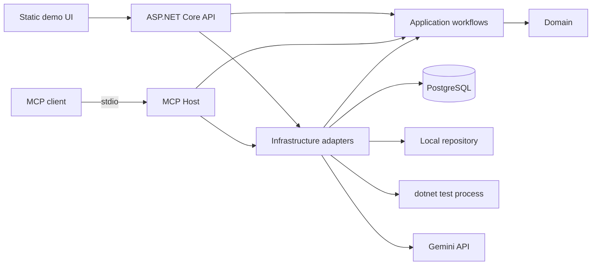

# CodeGuard AI

[](https://github.com/senagokaslan/CodeGuardAI/actions/workflows/ci.yml)

CodeGuard AI, makinede kayıtlı bir C# repository'sini sınırlı kurallarla tarayan, Gemini'den yapılandırılmış code-review bulguları alan ve seçilen bulgular için açık kullanıcı aksiyonuyla test önerileri üreten local-first bir portföy uygulamasıdır.

## Problem

Bir LLM'e doğrudan repository yolu veya shell komutu vermek; path traversal, secret sızıntısı, sınırsız çıktı, belirsiz retry ve sonsuz agent döngüsü gibi riskler doğurur. CodeGuard AI modeli serbest bir agent olarak değil, sabit adımlı workflow içindeki bir provider olarak kullanır. Filesystem ve test çalıştırma yetenekleri tek güvenli tool servisinde uygulanır; HTTP ve MCP yüzeyleri bu servisleri bypass etmez.

## Tamamlanan özellikler

- Project oluşturma/listeleme ve server-local repository root kaydı
- `.cs`, `.csproj` ve allowlist edilmiş JSON dosyaları için boyut/adet limitli tarama
- Secret adları, denied dizinler, root kaçışı ve reparse-point kontrolleri
- Gemini structured output, semantic grounding ve bounded transient retry
- Review state machine, max-step bütçesi, duplicate review conflict ve stale-run recovery
- Severity/category filtreli frameworksüz HTML/CSS/JavaScript demo arayüzü
- Seçili bulgular için ayrı ve explicit test önerisi aksiyonu
- Allowlist edilmiş `.csproj` hedefi için timeout/output-cap kontrollü `dotnet test`
- Resmi C# SDK ile stdio MCP `read_file` ve `run_tests` adapter'ları
- PostgreSQL/EF Core persistence, tool/model audit kayıtları ve structured logging
- Offline unit, API/integration, fake-LLM ve semantic eval suite'i
- Secretsiz GitHub Actions restore-build-test pipeline'ı

## Mimari



Bağımlılık yönü, ER modeli, review/AI akışı ve MCP tool zinciri için [mimari belgesine](docs/architecture.md) bak.

## Gereksinimler

- Windows üzerinde .NET SDK `10.0.103` (`global.json` ile pinli)
- Yerel PostgreSQL 18 ve `psql`
- Gemini API anahtarı
- Git

Container veya Docker gerektirmez ve proje bunlar için kurulum sözü vermez.

## Quickstart

PowerShell'i repository kökünde aç.

1. PostgreSQL'de sınırlı development rolü ve veritabanı oluştur:

```sql
CREATE ROLE codeguard_dev LOGIN NOSUPERUSER NOCREATEDB NOCREATEROLE NOREPLICATION;
\password codeguard_dev
CREATE DATABASE codeguard_dev OWNER codeguard_dev;
```

2. Secret'ları source control dışında kaydet:

```powershell
dotnet user-secrets set "Database:ConnectionString" "Host=localhost;Port=5432;Database=codeguard_dev;Username=codeguard_dev;Password=<DEV_PASSWORD>;Include Error Detail=false" --project src/CodeGuardAI.Api
dotnet user-secrets set "Gemini:ApiKey" "<GEMINI_API_KEY>" --project src/CodeGuardAI.Api
```

3. Tool ve bağımlılıkları restore et, migration'ları uygula:

```powershell
dotnet tool restore
dotnet restore CodeGuardAI.sln
dotnet ef database update --project src/CodeGuardAI.Infrastructure --startup-project src/CodeGuardAI.Api
```

4. API ve demo UI'yi başlat:

```powershell
dotnet run --project src/CodeGuardAI.Api --launch-profile http
```

Tarayıcıda `http://localhost:5253` adresini aç. Project path alanına browser makinesindeki değil, API'nin çalıştığı makinedeki tam klasör yolunu gir. Hazır örnek için bu repository altındaki `sample-repository` klasörünün tam yolunu kullan.

PostgreSQL kurulumu, migration, geri alma ve local database testi için [Windows PostgreSQL setup](docs/setup/postgresql-windows.md); configuration önceliği için [secret setup](docs/setup/configuration.md) belgesini izle.

## Testler

CI ile aynı secretsiz/offline doğrulama:

```powershell
dotnet restore CodeGuardAI.sln
dotnet build CodeGuardAI.sln --configuration Release --no-restore
dotnet test CodeGuardAI.sln --configuration Release --no-build --filter "Category!=Database"
```

Gerçek PostgreSQL testleri `Category=Database` etiketiyle local-only tutulur. Ayrıntılar [test stratejisinde](docs/testing.md) yer alır.

## MCP host

MCP yüzeyi yalnız iki tool sunar:

- `read_file(repositoryId, relativePath)`
- `run_tests(repositoryId, target)`

Host stdio kullanır ve yalnız database bağlantısına ihtiyaç duyar:

```powershell
$env:Database__ConnectionString = "<LOCAL_POSTGRES_CONNECTION_STRING>"
dotnet run --project src/CodeGuardAI.McpHost
```

MCP güvenlik katmanı değildir; mevcut `SafeFileReadTool` ve `SafeDotnetTestRunner` servislerinin ince protokol adapter'ıdır. Transport kararı [ADR-003](docs/adr/ADR-003-mcp-host.md) içinde açıklanır.

## Beş dakikalık demo

[Demo script](docs/demo-script.md) project kaydı, bounded scan, review bulguları, filtreleme ve explicit test önerisi akışını beş dakikaya sığdırır. [Görsel planı](screenshots/README.md), hangi ekranların ve güvenlik durumlarının gösterileceğini tanımlar.

## Güvenlik özeti

- Repository root istemciden tool çağrısında alınmaz; kayıtlı Project üzerinden çözülür.
- Mutlak/kaçan yollar, reparse point'ler, secret dosya adları ve arbitrary test komutları reddedilir.
- Timeout, output cap, cancellation ve audit ortak tool zarfında uygulanır.
- API/LLM/protocol cevaplarında raw exception veya secret döndürülmez.
- Prompt, API key, connection string ve repository içeriği structured loglara yazılmaz.

Tehdit modeli ve kalan riskler için [güvenlik belgesine](docs/security.md) bak.

## Limitations

- API authentication/authorization içermez; yalnız güvenilen local geliştirme makinesinde çalıştırılmalıdır ve internete açılmamalıdır.
- Yalnız C# odaklı `.cs`, `.csproj` ve belirli JSON dosyaları taranır; genel amaçlı repository analiz aracı değildir.
- Gemini kullanımı ağ erişimi, geçerli API anahtarı, kota ve provider erişilebilirliği gerektirir.
- Dosya adı politikası bilinen secret dosyalarını dışlar; allowlist edilmiş source dosyasına gömülmüş bir secret'ı semantik olarak garantiyle tespit etmez.
- `dotnet test`, yalnız kayıtlı root altındaki `.csproj` hedefini kabul eder; yine de MSBuild ve test kodu çalıştırdığı için yalnız güvenilen repository'lerde kullanılmalıdır.
- MCP yalnız local stdio ve tek istemci/process modelidir; uzak HTTP transport ve çok kullanıcılı auth yoktur.
- Hosted CI gerçek PostgreSQL testi çalıştırmaz; ilişkisel doğrulama ayrı local-only adımdır.
- Test önerileri repository dosyalarını değiştirmez; otomatik patch/commit özelliği yoktur.

## Kanıtlanabilir CV maddeleri

- .NET 10, ASP.NET Core, EF Core ve PostgreSQL ile katman bağımlılıkları architecture testleriyle korunan local-first code-review uygulaması geliştirdi.
- Gemini structured output'unu semantic grounding, bounded retry, offline fake-provider testleri ve beş fixture'lık eval suite'iyle doğruladı.
- Path traversal/reparse-point/secret-path savunmalı dosya okuma ve allowlist/timeout/output-cap kontrollü `dotnet test` araçlarını ortak audit zarfında tasarladı.
- Resmi ModelContextProtocol C# SDK ile güvenli tool servislerini bypass etmeyen stdio `read_file` ve `run_tests` adapter'ları geliştirdi.
- PostgreSQL filtered unique index'leri ve bounded C# state machine ile duplicate workflow, idempotency, cancellation ve stale-run recovery davranışlarını deterministik hale getirdi.
- Secretsiz GitHub Actions pipeline'ında pinli .NET SDK ile restore-build-offline-test kalite kapısı kurdu.

## Final checklist

- [x] README problem, mimari, quickstart, güvenlik ve limitations içeriyor.
- [x] Architecture, ER, AI ve MCP diyagramları güncel kodla karşılaştırıldı.
- [x] Windows PostgreSQL, User Secrets ve migration akışı fresh local database ile doğrulandı.
- [x] Beş dakikalık demo script'i ve 2-4 görsellik çekim planı hazırlandı.
- [x] CV maddeleri yalnız test veya kaynak kodla kanıtlanabilen özelliklerden oluşuyor.
- [x] Offline Release build/test yeşil ve database test sınırı açık.
- [x] Repository secret taraması temiz.
- [ ] Geçerli bir Gemini API key ile başarılı review/test önerisi demosu ve sonuç ekranları yeniden çekilecek; mevcut local key provider tarafından `API_KEY_INVALID` olarak reddedildi.
- [ ] GitHub hosted CI run yeşil olarak doğrulanacak; ilk run'ın test adımı teşhis için unit/eval ve API/integration adımlarına ayrıldı.

## Dokümantasyon haritası

- [Mimari ve diyagramlar](docs/architecture.md)
- [Güvenlik modeli](docs/security.md)
- [Demo script](docs/demo-script.md)
- [Test stratejisi](docs/testing.md)
- [Evaluation sözlüğü](docs/evaluation.md)
- [Workflow safety](docs/workflow-safety.md)
- [ADR kayıtları](docs/adr)
