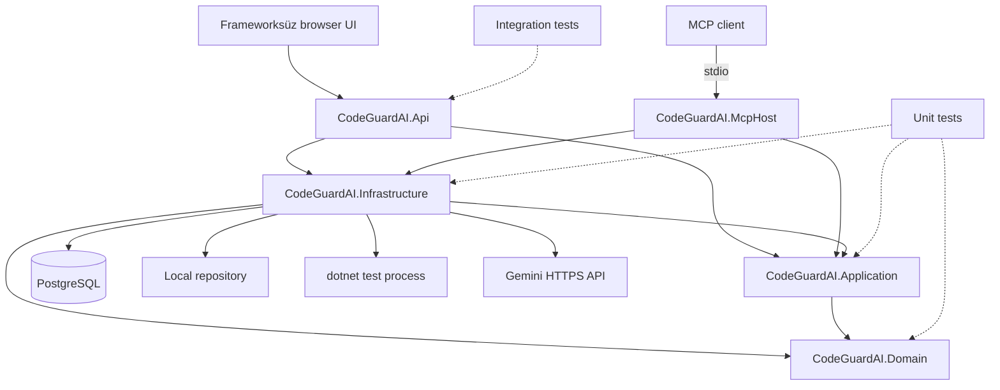
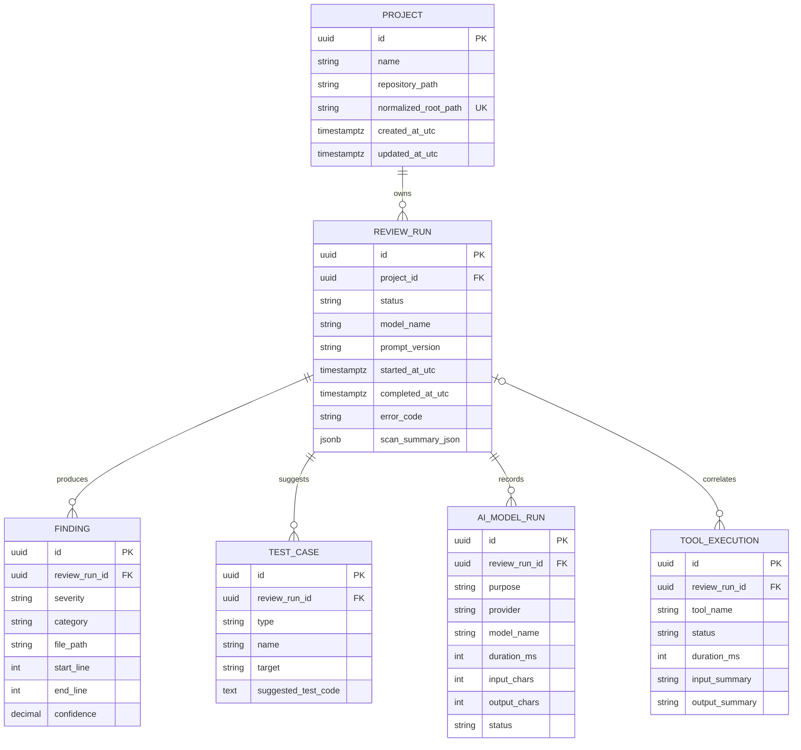
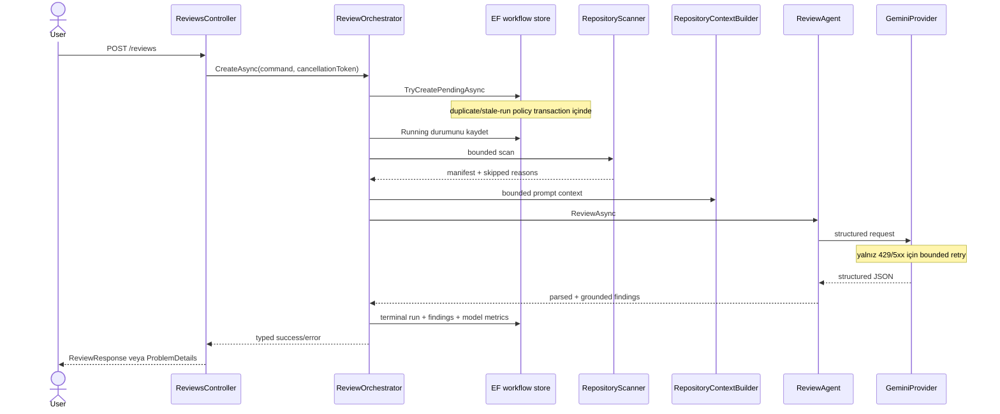
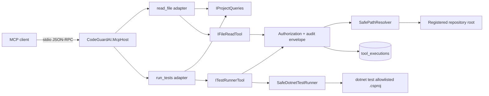

# Mimari

Bu belge, production project reference'ları, EF mapping'leri, workflow'lar ve MCP adapter'larıyla karşılaştırılmış güncel mimariyi gösterir. Karar gerekçeleri [ADR-001](adr/ADR-001-modular-monolith.md) ve [ADR-003](adr/ADR-003-mcp-host.md) içinde tutulur.

## Katmanlar ve bağımlılık yönü

- Domain dış sisteme veya üst katmana referans vermez.
- Application use case, port, state machine ve typed result'ları taşır; Infrastructure veya MCP SDK'yı bilmez.
- Infrastructure EF Core, Npgsql, filesystem, process ve Gemini adapter'larını uygular.
- API HTTP contract ve composition root'tur. MCP Host ayrı executable ve yalnız protokol adapter'ıdır.
- `ModelContextProtocol` NuGet bağımlılığı yalnız MCP Host projesindedir.

## ER diyagramı

Önemli kalıcı garantiler:

- `projects.normalized_root_path` unique'tir.
- Aynı project için `Pending`/`Running` review'larda filtreli unique index vardır.
- Aynı review için yalnız bir başarılı `TestGeneration` model run'ı olabilir.
- Finding confidence/line aralıkları ile metrik süreleri check constraint'lerle korunur.
- Project veya ReviewRun silinmesi ilişkili kayıtları cascade eder.

## Review ve AI akışı

Review adımları sabittir; model yeni workflow adımı üretemez ve agent başka agent çağırmaz. Cancellation scanner/provider/tool zincirine taşınır; başlamış review iptalinde terminal `Failed/Cancelled` kaydı request token'dan bağımsız persist edilir. Test önerisi aynı review için ayrı kullanıcı aksiyonudur ve repository'yi değiştirmez.

## MCP tool zinciri

MCP input'u root path, shell command, working directory, executable, timeout veya output cap belirleyemez. Root server-side Project kaydından gelir; limitler shared options'tan gelir. Testlerin non-zero sonucu `tests_failed`, tool altyapı/policy hatası `tool_error` olarak ayrılır. Beklenmeyen exception ve stack trace protokole çıkmaz; cancellation yeniden fırlatılır.

## Public contract ve failure davranışı

- API validation/typed application error'larını `ProblemDetails` ve stable error code'a map eder.
- Review terminal durumları `Completed` veya `Failed` olarak persist edilir.
- PostgreSQL concurrency constraint yarışın son kararını verir; process-local lock kullanılmaz.
- Gemini transport retry'sı orchestrator adım bütçesinden ayrıdır.
- Log scope `CorrelationId`, `ReviewRunId` ve `ProjectId` taşır; prompt, secret ve repository içeriği taşımaz.
- CI dış servis kullanmadan Application/API sözleşmesini doğrular; gerçek PostgreSQL davranışı local-only testtir.
